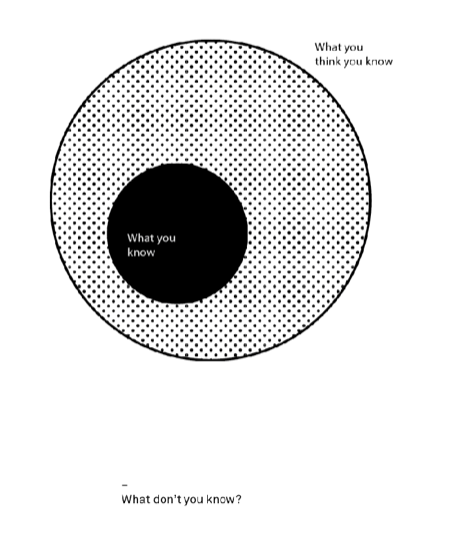

# Circle of Competence

## Outline
1. What is a circle of competence?
2. How do you know when you have one?
3. How do you build and maintain one?
4. How do you operate outside of one?

## What is a Circle of Competence?
* The idea a circle of competence in the realm of investments was stated very well by Berkshire Hathaway’s Warren Buffett.
* He recommends that each person stick to his area of competence and be very reluctant to stray away.
* Story: Russian CEO woman, Rose Blumkin who could barely speak English or read or write but she knew numbers and home furnishings. She understands Cash & Furniture.
* Her super focus on the things she knew best was largely responsible for her success.
* understanding your area of competence (what you know and what you don't know) => improves decision-making.
* Metaphore: Lifer in a small town vs. the Stranger.
    - Without detailed history how can the Stranger know he has picked the right land for development or negotiated the best price?
    - Difference b/t the detailed web of knowledge in the Lifers head and the surface knowledge in the Strangers is the diffeerence b/t being inside a circle of competence and outside one.
* Metaphore 2: The Sherpa people on Mt. Everest. The Sherpa Tenzing Norgay led the first ascent. 1/4 of all subsequent climbs have been aided by Sherpa's. There are 200 bodies on Everest. The Sherpa people have specialized in climbing of Everest.

## How do we know our circle of competence?
* Do you have a few years and a few failures under your belt?
* We should know what we don't know. We also know what is knowable and what not and how to distinguish the two.
* We can respond to and anticipate objections, steelman other perspectives, b/c we've heard them before and have put in the work to know if they are right/wrong, etc.
* It cannot be built quickly. It can't come from a few courses or books, or trying for a few months.
* Quote by Alexander Pope:
> “A little learning is a dangerous thing;
> Drink deep, or taste not the Pierian spring: (Macedonia, sacred to Pierides and the Muses), metaphorical source of knowledge of art & science)
> There shallow draughts intoxicate the brain,
> And drinking largely sobers us again.”
* There is no shortcut to understanding. Building a circle of competence takes years of experience, making mistakes, and of actively seeking out better methods of practice and thought.
* Can you sketch an outline of your field? Can you list the different ways to solve a problem?
    * Math/Physics: Can you pick any book from your field and discuss the topic?
    * Math/Physics: Can you pick any textbook and solve the problems w/out studying the chapter?
* How do you know what you don't know?
    * Compare your concept map to wikipedia's or a dictionary's? Did you miss things?
    * Try the five why's? Dig into the how or why for multiple levels.

## How do we build and maintain a circle of competence?
* A circle of competence is not static.
* The world is dynamic and changing, knowledge gets updated.
* 3 Key practices
    * curiousity and a desire to learn
    * monitoring
    * feedback
* no.1: be willing to learn
    * Learn from your own experiences: experience meets reflection. (journaling)
    * Learn from the experiences of others: courses, books, tv, articles, conversations.
        * You will get to see and learn from mistakes you haven't had the time to make yourself.
* Monitor your track record:
    * Be honest so you can use feedback (Basketball example)
    * Studies show we are overconfident - we have problems with honest self-reporting.
    * Ego is a big enemy - we don't really want to know what we are good and bad at.
    * If you trade stocks: look at/track your wins/losses, figure out why you lose/win.
    * If you are a leader: chronicle the results of your decisions+outcomes.
    * Keep a journal of your own performance.
    * Be honest about your failures - otherwise you won't learn
    * Occasionally: solicit external feedback.
        * Metaphore: Surgeon hired a coach to get better.
        * Its difficult if you become defensive: focus on the result you would like to achieve.

## How do you operate outside your circle of competence?
* Learn the basics, acknowledge you are a Stranger not a Lifer.
* Talk to someone whose circle of competence in the area is strong.
    * Use the same techniques for your own circle of competence to test theirs if you can.
    * Probe the limits of their circle of competence with questions.
* Use other mental models and tools (such as the map is not the territory, etc.) to nagivate the unknown landscape and make informed decisions and choices.
* You will be a Stranger in some areas even in your own area of Expertise

### Issues to Watch out for in other people's circle of competences
1. The Problem of Incentives can skew yours and others circle of competence.
    * Ex: (Finance) Until recently most financial products had commissions attached - an advisor made money by giving us one piece of advice over another.
    * Ex2: (Sales) Buying furniture, a house, washing machine - sales person gets a comission - are we getting there true evaluation of the product for our needs?
    * Ex3: (Medical) Dentistry
2. Can they steelman other perspectives (bias detector)? Can they truly represent the views of the other side in an unbiased way (i.e. if you were on the other side would you feel like they were talking down to you or being misleading about your views)?

## Conclusion
> “Ignorance more often begets confidence than knowledge.” (Charles Darwin)

## Dunning Kruger Effect
1. [Wikipedia Dunning Kruger Effect](https://en.wikipedia.org/wiki/Dunning%E2%80%93Kruger_effect)