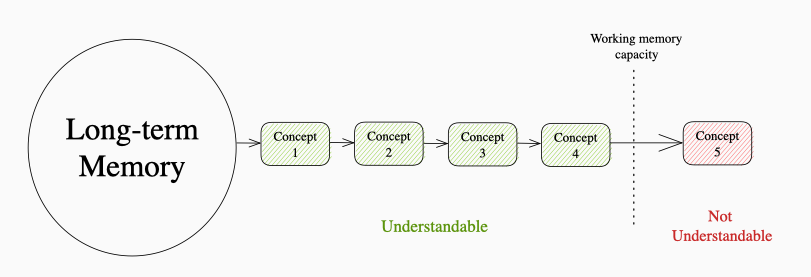
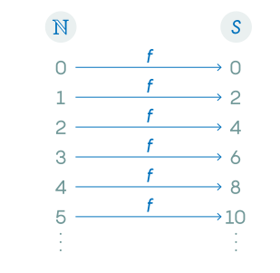
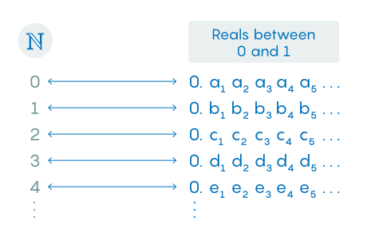
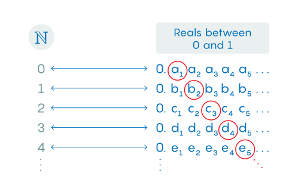

# Topics

1. Learning is Remembering
2. Turns are better than radians
3. How Big is Infinity

## Learning is Remembering

* Example learning quantum mechanics from zero using wikipedia.
* Ex: unknown concept 1 => unknown concept 2 => ...
* Why doesn't learning this way work?
    * Working memory has a limited capacity of about (3-5 items). (Nelson Cowan from University of Missouri)
    * When we encounter unknown concept 1, we must store it in our working memory, then once we have 4 such, we cannot understand concept 5.

* Rule: you can only understand something new if understanding it requires combining less than 4 new pieces of information.
* Also: 4 is very difficult, usually 1 or 2 are more manageable and require less intense focus.
* Working memory is limited (cannot be extended)
* Long-term memory is virtually limitless (could store the entire internet of 2016)
* Path for learning => stop forgetting i.e. move things to long-term memory.
* Learning => an alteration of long-term memory (uk school inspection body Ofsted 2019)
    * Learning is intimately related to memory.
* People forget 90% of what they learn in a month (Ebbinghaus's forgetting curve 1880s)
* "good" explanations, essays, math problems, assignments, diagrams, help move things into your long-term memory.

* Why not just google it? You have to store that new concept into 1 of your working memory slots, reducing thinking efficiency and ability.

## Turns are better than radians

* assertion: remove pi entirely from programming.
* use cases of pi in code: converting to and from radians for calling trigonometric functions.
* most implementations of the trigonometric functions multiply the value by a constant at the start of the function, for example 4/pi.
* This means calling sin(h * 2 * pi) becomes y = (4/pi) * x, or y = (4/pi) * (h*2*pi) = (8 * h)
* why not just agree to use [0,1] domain for h.
* 90 degrees on [0,1] is just 0.25, 270 degrees is 0.75, 60 degrees is 1/6
* In `turns` 0 is 0 degrees, 0.5 is 180 degrees, 1 is 360, 2 is 720, etc.
* Won't work though if you take derivatives or formulas involving trig functions.

## How Big is Infinity

* A set is a collection of objects, finite sets contain finite numbers of elements {1,2,3,4}.
    * To find a finite sets size, just count the number of elements.
* Some sets of numbers are infinitely large (natural numbers, integers)
* These are known as countable (or listable infinities), they all have the same size
    * i.e. you can formulate a rule which maps all these sets onto the natural numbers.
* But the real numbers are different.
    * Between any two natural numbers (say 3 and 7), there will always be infinitely many real numbers b/t them.
    * No matter how close 3.001 and 3.0011 => there will be finite real numbers b/t them.
* Georg Cantor investigated this problem, showed that the two sets do indeed have different sizes.
* How he approached it:

* If a number 3,472 is in S, then we can find x in the natural numbers s.th. f(x)=3,472. f(x) is surjective, as f turns inputs in N to ouputs in S, no element in S is neglected.
* No two elements in N get mapped to the same element in S, f(x) is "1-to-1" or injective. Nothing in S gets used twice.
* This is a bijection, (when a function is both injective and surjective), it creates a 1-to-1 correspondence b/t the two sets.
* If we can find such a function mapping b/t two infinite sets, then those sets have the same size.
* Paradox: one infinite set can completely contain another and they can still be the same "size".

* Cantor's Proof that the real numbers and naturals are different sized infinities. 
* Question: What would happen if a bijection existed b/t the real numbers [0,1] and the natural numbers.
    * If a function existed => the two sets would have the same size.

* Create a new number on the list by going down the mapping's diagonal and changing each cell to a different value.
* The new number can't be number 1 on the list, or 2, or 3 or any of the n-items.
* Therefore, it must be a new number b/t 0 and 1 but not on the list => but all were supposed to be on the list => contradiction.

* Thus, no such bijection can exist (because assuming its existence got us the contradiction).
* Also, the set of all real numbers is the same size as the set of reals b/t 0 and 1.

# Apps & Services
1. Quazel